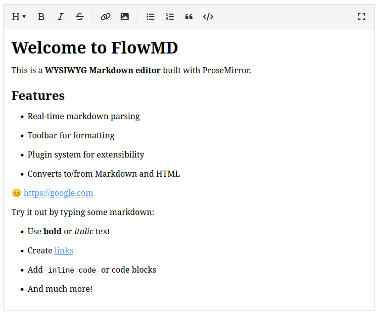

# FlowMD - WYSIWYG Markdown Editor

FlowMD is a powerful WYSIWYG Markdown editor built with ProseMirror that provides a rich editing experience with a plugin system for extensibility.



## Features

- **WYSIWYG Editing**: Edit Markdown with a rich text interface
- **Real-time Preview**: See your formatted content as you type
- **Markdown Support**: Full Markdown syntax support
- **Conversion Utilities**: Convert between Markdown and HTML
- **Plugin System**: Extend the editor with custom plugins
- **Optional Toolbar**: Format text with an intuitive toolbar with configurable buttons
- **Toolbar Dropdowns**: Dropdown menus for complex options like heading levels
- **Toolbar Layout**: Customize toolbar with separators and spacers for better organization
- **Form Integration**: Seamless integration with HTML forms for easy content submission
- **Flexible Height Settings**: Control editor height with min, max, and fixed height options
- **PopperJS Integration**: Dropdowns are positioned using PopperJS for better UX
- **TypeScript Support**: Built with TypeScript for better developer experience
- **SASS Styling**: Easily customize the look and feel with SASS

## Installation

Install FlowMD using npm:

```bash
npm install @wuild/flowmd
```

Or using yarn:

```bash
yarn add @wuild/flowmd
```

## Usage

### Basic Usage

```javascript
import { createEditor } from '@wuild/flowmd';
import '@wuild/flowmd/styles/editor.css';

// Get the container element
const editorElement = document.getElementById('editor');

// Create the editor
const editor = createEditor({
  element: editorElement,
  content: '# Hello World',
  toolbar: true
});
```

### Configuration Options

```javascript
const editor = createEditor({
  // Required: The container element where the editor will be mounted
  element: document.getElementById('editor'),

  // Optional: Initial content in markdown format
  content: '# Getting Started\n\nThis is a **markdown** editor.',

  // Optional: Placeholder text when editor is empty
  placeholder: 'Start writing...',

  // Optional: Toolbar configuration
  // true = show all buttons, string = configure which buttons to show
  toolbar: "heading,bold,italic,|,link,image,|,bullet_list,ordered_list",

  // Optional: Container element for the toolbar
  toolbarContainer: document.getElementById('custom-toolbar'),

  // Optional: Name attribute for hidden textarea to sync markdown content for form submission
  textarea: 'content',

  // Optional: Height settings
  height: '400px',      // Fixed height
  maxHeight: '600px',   // Maximum height
  minHeight: '200px',   // Minimum height

  // Optional: Plugin-specific options
  pluginOptions: {
    // Options for the image plugin
    image: {
      upload: true,
      uploadUrl: "https://api.example.com/upload"
    }
  },

  // Optional: Callback when content changes
  onChange: (markdown, html) => {
    console.log('Content changed:', markdown);
  }
});
```

### Working with Content

```javascript
// Get content as Markdown
const markdown = editor.getMarkdown();

// Get content as HTML
const html = editor.getHTML();

// Set content programmatically
editor.setContent('# New Content');

// Listen for content changes
editor.addEventListener('change', ({ markdown, html }) => {
  console.log('Content changed:', markdown);
});
```

## Documentation

FlowMD comes with comprehensive documentation to help you get started and make the most of the editor:

- [User Guide](docs/user-guide.md) - Learn how to use FlowMD in your projects
- [API Reference](docs/api-reference.md) - Comprehensive reference for the FlowMD API
- [Plugin Development Guide](docs/plugin-development.md) - Learn how to extend FlowMD with custom plugins
- [Documentation Index](docs/README.md) - Overview of all documentation resources

## Building from Source

To build FlowMD from source:

1. Clone the repository:
   ```bash
   git clone https://github.com/yourusername/flowmd.git
   cd flowmd
   ```

2. Install dependencies:
   ```bash
   npm install
   ```

3. Run the development server:
   ```bash
   npm run dev
   ```

4. Build for production:
   ```bash
   npm run build
   ```

## Contributing

Contributions are welcome! Here's how you can contribute:

1. Fork the repository
2. Create a feature branch: `git checkout -b feature/my-feature`
3. Commit your changes: `git commit -am 'Add some feature'`
4. Push to the branch: `git push origin feature/my-feature`
5. Submit a pull request

Please make sure to update tests as appropriate and follow the code style guidelines.

### Continuous Integration

This project uses GitHub Actions for continuous integration:

- Tests are automatically run on pull requests and must pass before merging
- When a new release is published, the code is automatically tested, built, and published to NPM

You can run the same checks locally:

```bash
# Run tests
npm test

# Run linting
npm run lint:check

# Run formatting check
npm run format:check
```

## License

FlowMD is licensed under the MIT License. See the [LICENSE](LICENSE) file for details.
